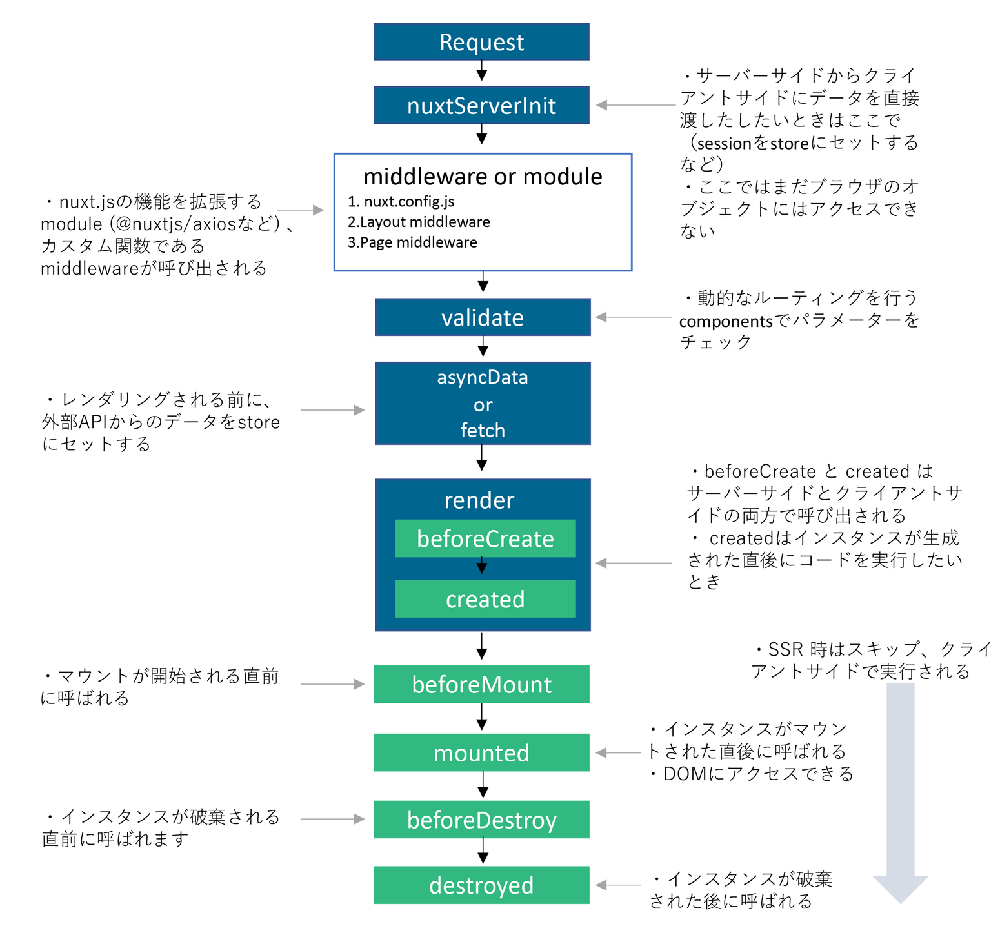

# Enqueter Front

## memo

回答数 正答率 ポイント

## Summary
EnqueterプロジェクトのFront。Vue.js(Nuxt.js)を使用

* setup
```
# confirm vue version
$ yarn list vue
yarn list v1.22.17
warning Filtering by arguments is deprecated. Please use the pattern option instead.
└─ vue@2.6.14
✨ Done in 0.68s.

# global install (ok once)
$ npm install -g yarn

# terminal
$ yarn add @nuxtjs/vuetify -D

# nuxt.config.js
{
  buildModules: [
    // Simple usage
    '@nuxtjs/vuetify',
  ]
}
```

## vuexのtypescript化
（参考）
> https://tech.smartshopping.co.jp/nuxt-typed-vuex


## build and CI/CD
* build

```
$ yarn run generate
```

* confirming netlify
```
drag dist dir on your netlify
```

# ライフサイクル

